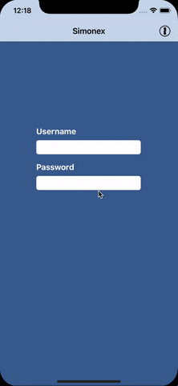

Simonex
=======

## TL;DR

**Sim**ulated **One**Password **Ex**tension for using [1Password app extension](https://github.com/agilebits/onepassword-app-extension) during development.



## How it works

__Simonex__ creates a single dylib which on load hooks via Objc's runtime into the current application under development and replaces _findLoginForURLString:forViewController:sender:completion:_ to provide username and password with a single tap onto the 1Password icon.

## F.A.Q

Q: How to insert/change username/password within Simonex?  
A: Usernames and passwords are hardcoded and found in __simonex.m__. Customize *_credentials* within *viewDidLoad*, recreate the dylib, and restart your application or reload the dylib to let the changes take effect.

Q: Why hardcoded usernames and passwords?  
A: Very simple to move username and password between simulators and devices without worrying about sandboxes and access rights, if the _dylib_ could be loaded, username and password could be too.

Q: How to create the _simonex.dylib_?  
A: Just call _make_ and that should do the trick.

Q: Code signing of *simonex.dylib* did not work, what can I do?  
A: Either call _make dylib_ and sign manually via
```
codesign -f -s YOUR_CODESIGN_IDENTITY
```   
or call
```
make CODESIGN_IDENTITY="Your iPhone Developer identity"
```

Q: How to install __Simonex__?  
A: Via Xcode and environment variables
```
DYLD_INSERT_LIBRARIES="/YOUR_PATH_TO/simonex.dylib"
```
or _lldb_
```Python
 exp (void *)dlopen("/YOUR_PATH_TO/simonex.dylib", 0x2)
```

Q: Why use a dylib with method swizzling instead of creating an iOS extension?  
A: Less project overhead and very simple to use it on multiple simulators or devices without creating and installing an app exension every time.

Q: Will it run within the simulator only or on devices too?  
A: Simonex runs on both simulator and devices.

Q: Will it affect my AppStore app in any way?  
A: Nope, Simonex runs only during development, either injected via Xcode or lldb.

Q: How can I automatically inject _simonex.dylib_ via lldb?  
A: Insert following lines into your _.lldbinit_ file.
```Python
br set -S "+[OnePasswordExtension sharedExtension]" -o true -N simonex  
br command add  
exp (void *)dlopen("/YOUR_PATH_TO/simonex.dylib", 0x2)  
continue  
DONE  
```

To disable automatic lldb injection either delete above lines from your _.lldbinit_ file or insert  
```Python
br dis -N simonex  
```

to temporarily disable the breakpoint and therefore the code injection.  
Use it in conjunction with [Trampoline](https://github.com/obayer/Trampoline) to inject _simonex.dylib_ only for a
specific target and/or architecture.
